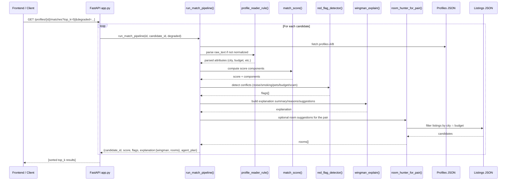

# Room Matcher AI Backend (FastAPI)

This FastAPI backend powers a minimal multi-agent roommate matcher and room listing search for cities in Pakistan. It exposes endpoints to:

- Compute compatibility matches between profiles
- Explain matches and flag potential conflicts

- Suggest rooms for a given profile
- Search room listings via free-text (auto-parsed) or structured filters
- Return dataset statistics

Primary files:

- `app.py` — all logic and API endpoints
- `synthetic_roommate_profiles_pakistan_400.json` — profiles dataset
- `housing_listings_pakistan_400.json` — room listings dataset

## Architecture

```mermaid
flowchart TB
    subgraph Client
      FE[Frontend App\nhttp://localhost:3000]
      CURL[CLI / cURL / Postman]
    end

    subgraph Backend[FastAPI Backend (uvicorn) — app.py]
      CORS[[CORS Middleware\nlocalhost:3000 allowed]]
      API[/REST Endpoints/]

      subgraph MatchingPipeline[run_match_pipeline()]
        PR[Profile Reader\nprofile_reader_rule()]
        MS[Match Scorer\nmatch_score()]
        RF[Red Flag Detector\nred_flag_detector()]
        WX[Wingman Explainability\nwingman_explain()]
        RH[Room Hunter for Pair\nroom_hunter_for_pair()]
        PLAN[(agent_plan trace)]
      end

      subgraph RoomSearch[/rooms/search/]
        RT[Raw text parser\nprofile_reader_rule()]
        NF[Normalize filters\ncities/budget\namenities_any/all\namenity_weights]
        FZ[Fuzzy amenity mapping\namenity_to_canonical()]
        FL[Filter listings\ncity/budget/amenities]
        SS[Score listings\nrent+amenity score]
      end
    end

    subgraph Data[Local Datasets (JSON files)]
      PROFILES[(synthetic_roommate_profiles_pakistan_400.json)]
      LISTINGS[(housing_listings_pakistan_400.json)]
    end

    FE -->|HTTP| CORS --> API
    CURL --> API

    API -->|GET /profiles/{id}/matches\nPOST /match| MatchingPipeline
    API -->|GET /profiles/{id}/rooms| RH
    API -->|POST /rooms/search| RoomSearch
    API -->|GET /profiles, /profiles/{id}, /parse, /stats, /health| Backend

    PR --> PROFILES
    MS --> PROFILES
    RF --> PROFILES
    RH --> LISTINGS

    RT --> PROFILES
    FL --> LISTINGS
    SS --> LISTINGS

    PR --> MS --> RF --> WX --> RH --> PLAN
```

Sequence: Top roommate matches request



## Quick Start
Requirements:

- Python 3.11+ (tested with 3.12)

Create and activate a virtual environment, then install dependencies:

```bash
python3 -m venv venv
source venv/bin/activate  # on Windows: venv\Scripts\activate
pip install -r requirements.txt
```

Run the API server:

```bash
uvicorn app:app --reload --port 8000
```

Health check:

```bash
curl -s http://127.0.0.1:8000/health | jq
```

You can also open interactive docs:

```text
Swagger UI: http://127.0.0.1:8000/docs
ReDoc:      http://127.0.0.1:8000/redoc
```

## Makefile (Optional)

A `Makefile` provides shortcuts for common tasks:

- `make venv` — create a Python virtual environment
- `make install` — install dependencies from `requirements.txt` into the venv
- `make run` — run the app using uvicorn with reload on port 8000
- `make docker-build` — build a Docker image tagged `room-matcher-backend`
- `make docker-run` — run the image, mapping port 8000
- `make clean` — remove caches and build artifacts

Example:

```bash
make venv
make install
make run
```

## Docker (Optional)

Build and run with Docker:

```bash
make docker-build
make docker-run
# or directly
docker build -t room-matcher-backend .
docker run --rm -p 8000:8000 room-matcher-backend
```

## CORS

This backend allows requests from these development origins by default:

- `http://localhost:3000`
- `http://127.0.0.1:3000`

To change allowed origins, edit the `origins` list near `app = FastAPI(...)` in `app.py`.

## Datasets

By default, the app loads these files from the project root:

- Profiles: `synthetic_roommate_profiles_pakistan_400.json`
- Listings: `housing_listings_pakistan_400.json`

You can change the filenames by editing the constants at the top of `app.py`:

```python
PROFILES_FILE = "synthetic_roommate_profiles_pakistan_400.json"
LISTINGS_FILE = "housing_listings_pakistan_400.json"
```

## API Overview

Base URL (dev): `http://127.0.0.1:8000`

Endpoints:

- `GET /health`
  - Health check and dataset load counts

- `GET /profiles?limit=100`
  - List profiles (IDs like `R-001`)

- `GET /profiles/{profile_id}`
  - Get a single profile by ID

- `POST /parse`
  - Parse free text into a structured profile-like object
  - Request body:
    ```json
    {
      "raw_text": "Need room in Lahore, budget 20k",
      "source_id": "optional-string"
    }
    ```

- `GET /profiles/{profile_id}/matches?top_k=5&degraded=false`
  - Top matches for a given profile against the dataset
  - Returns an array of match objects with score, flags, and explainability info

- `GET /profiles/{profile_id}/rooms?top_n=5`
  - Room suggestions for a single profile based on that profile’s city and budget

- `POST /match`
  - Pairwise match between two profile IDs
  - Request body:
    ```json
    {
      "profile_a": "R-001",
      "profile_b": "R-010",
      "degraded": false
    }
    ```

- `POST /rooms/search`
  - Search room listings using a free-text query or structured filters
  - The backend prioritizes `raw_text` and ignores placeholder fields like `"string"` or 0
  - If no budget is provided or parsed, it uses per-city rent quartiles (25th–75th percentile), or global quartiles if city is unknown
  - Supports multiple cities via `cities`, amenity filters via `amenities_any` (OR) and `amenities_all` (AND), and a minimum score cutoff via `min_score` (0–1)
  - Supports fuzzy amenity matching (e.g., `"AC" ~ "aircon" ~ "air conditioning" ~ `"a/c"`) and amenity weighting via `amenity_weights`
  - Request body examples:
    - Free text only:
      ```json
      {
        "raw_text": "Hostel seat available G-11, Lahore.",
        "top_n": 5
      }
      ```
    - Free text with budget:
      ```json
      {
        "raw_text": "Room in Lahore near G-11, budget 20k",
        "top_n": 5
      }
      ```
    - Structured filters:
      ```json
      {
        "city": "Lahore",
        "budget_min": 15000,
        "budget_max": 22000,
        "top_n": 5
      }
      ```
    - Multiple cities:
      ```json
      {
        "cities": ["Lahore", "Karachi"],
        "top_n": 5
      }
      ```
    - Amenity filters (must include all, and include any of the OR list):
      ```json
      {
        "city": "Lahore",
        "amenities_all": ["Wifi", "AC"],
        "amenities_any": ["Parking", "Laundry"],
        "top_n": 5
      }
      ```
    - With min score cutoff and multiple cities:
      ```json
      {
        "cities": ["Islamabad", "Rawalpindi"],
        "budget_min": 15000,
        "budget_max": 22000,
        "amenities_all": ["Wifi", "Furnished"],
        "min_score": 0.65,
        "top_n": 5
      }
      ```
    - Weighted amenities (fuzzy matching enabled):
      ```json
      {
        "city": "Karachi",
        "amenities_any": ["air conditioning", "internet"],
        "amenity_weights": {"AC": 2.0, "Wifi": 1.0},
        "top_n": 5
      }
      ```
  - Response shape:
    ```json
    {
      "rooms": [
        {
          "listing_id": "L-123",
          "city": "Lahore",
          "area": "Gulberg",
          "monthly_rent_PKR": 20000,
          "amenities": ["Wifi", "AC"],
          "score": 0.82
        }
      ],
      "applied_filters": {
        "cities": ["lahore", "karachi"],
        "budget_min": 15000,
        "budget_max": 22000,
        "amenities_any": ["parking", "laundry"],
        "amenities_all": ["wifi", "ac"],
        "amenity_weights": {"ac": 2.0, "wifi": 1.0},
        "min_score": 0.65
      }
    }
    ```

## How Matching Works (High Level)

- `profile_reader_rule()` parses free-text into normalized attributes: city, budget, cleanliness (1-5), sleep schedule, noise tolerance, smoking/pets, food_pref
- `match_score()` computes a weighted compatibility score using sleep, cleanliness, noise, budget overlap, and special alignment (smoking/pets)
- `red_flag_detector()` flags potential conflicts like noise, smoking, pets, budget mismatch, suspicious text
- `wingman_explain()` builds a summary with reasons and suggestions
- `room_hunter_for_pair()` searches listings for rooms matching the pair’s intersected budget and city

## Degraded Mode

Degraded mode provides an explicit lightweight path optimized for offline or low-bandwidth usage.

- Behavior (when `degraded=true`):
  - Prefilters candidate profiles by same city and a minimum budget overlap (IoU) before scoring.
  - Uses a simplified scorer that emphasizes budget overlap and cleanliness similarity.
  - Produces a brief explanation and minimal flags (budget mismatch only).
  - Skips room suggestions by default (configurable).

- Configuration (constants in `app.py`):
  - `DEGRADED_MAX_CANDIDATES` — cap on candidate pool after prefilter (default 120)
  - `DEGRADED_MIN_BUDGET_IOU` — minimum budget IoU to keep candidate (default 0.10)
  - `DEGRADED_ROOM_COUNT` — number of suggested rooms in degraded path (default 0 = skip)

- How to use:
  - Top matches (GET):
    ```bash
    curl -s "http://127.0.0.1:8000/profiles/R-001/matches?top_k=5&degraded=true" | jq
    ```
  - Pairwise (POST):
    ```bash
    curl -s -X POST http://127.0.0.1:8000/match \
      -H "Content-Type: application/json" \
      -d '{
        "profile_a": "R-001",
        "profile_b": "R-010",
        "degraded": true
      }' | jq
    ```

- Notes:
  - Default is full mode (`degraded=false`).
  - All logic remains fully offline; degraded mode reduces compute and explanation verbosity.

## Frontend Integration Tips

From a frontend running on `http://localhost:3000`, call the backend directly (CORS enabled):

```ts
const res = await fetch('http://127.0.0.1:8000/rooms/search', {
  method: 'POST',
  headers: { 'Content-Type': 'application/json' },
  body: JSON.stringify({ raw_text: 'Room in Lahore budget 20k', top_n: 5 })
});
const data = await res.json();
```

Alternatively, configure a dev proxy (e.g., Next.js `rewrites`) to avoid cross-origin calls.

## Development Notes

- If you change allowed frontend origins, edit the `origins` list near `app = FastAPI(...)` in `app.py`
- To run on a different port: `uvicorn app:app --reload --port 9000`
- Logs and exceptions appear in the terminal where you run uvicorn

## License

MIT (or your preferred license).
